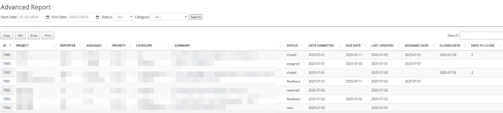

# 🐞 Advanced Report List for MantisBT

**Advanced Report List** is a plugin for Mantis Bug Tracker (MantisBT) that displays an advanced bug reporting interface with detailed tracking and filtering features. This plugin helps teams monitor issue resolution timelines with the ability to export data in various formats.

---

## ✨ Features

- 📅 **Track lifecycle of bugs**, including:
  - **Assigned date**
  - **Closed date**
  - **Days to close** (from assigned to closed)
- 🔍 **Filter reports** by:
  - Submission **date range**
  - Bug **status** (new, feedback, assigned, resolved, closed)
  - Bug **category**
- 📊 **DataTables integration** for:
  - Column sorting
  - Pagination
  - Search
  - Horizontal scrolling for wide tables
- 📁 **Export options**:
  - 🧾 **Excel (.xlsx)**
  - 📄 **CSV**
  - 🖨️ **Print-friendly report**
  - 📚 **PDF (optional)**

---

## 📷 Screenshots



---

## 🔧 Installation

1. Clone or download this repository into your MantisBT `/plugins/` directory:

```bash
cd /path/to/mantis/plugins
git clone https://github.com/your-username/AdvancedReportList.git
